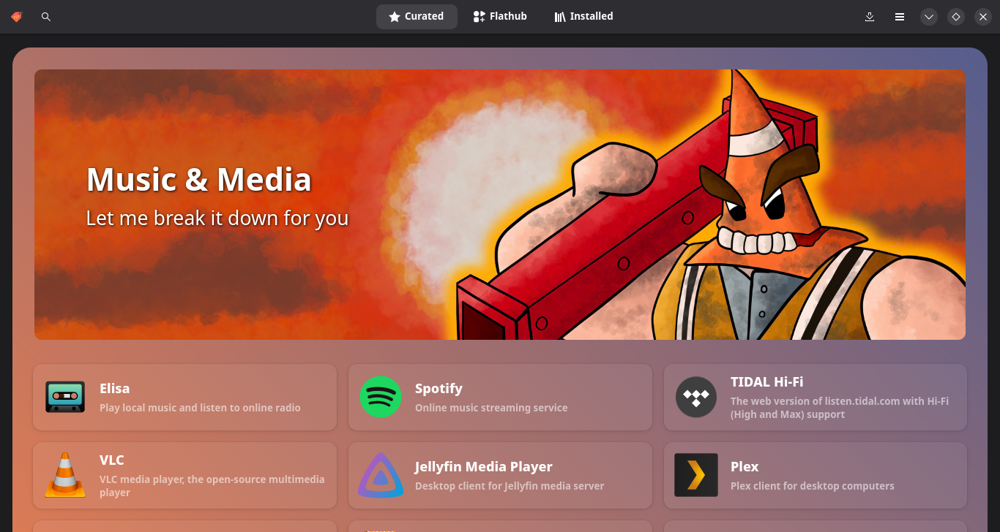
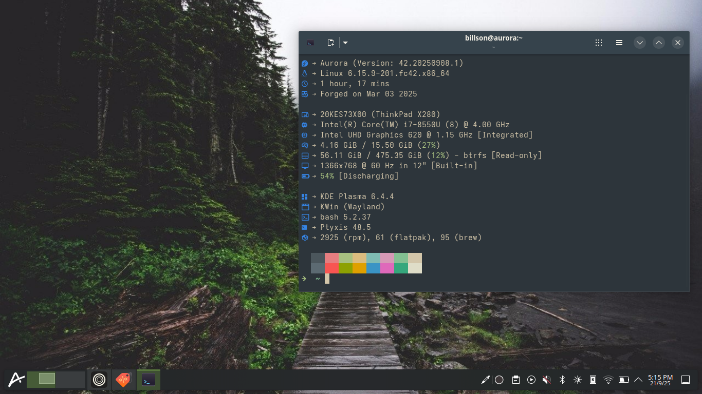
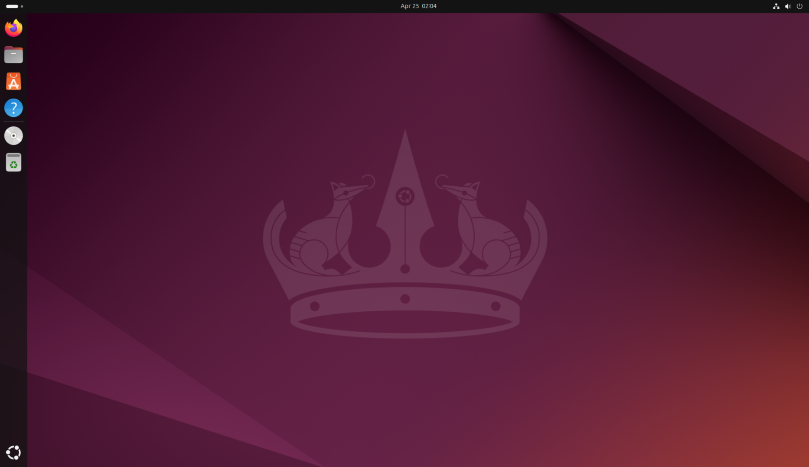
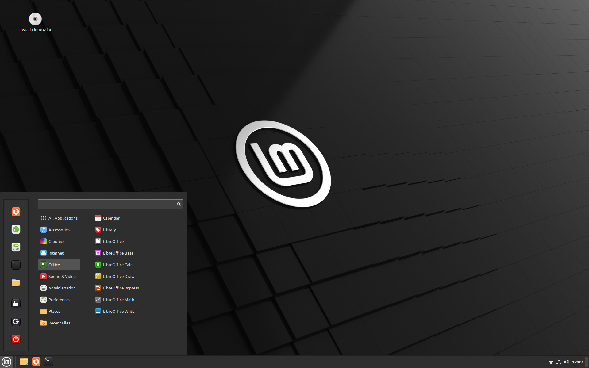
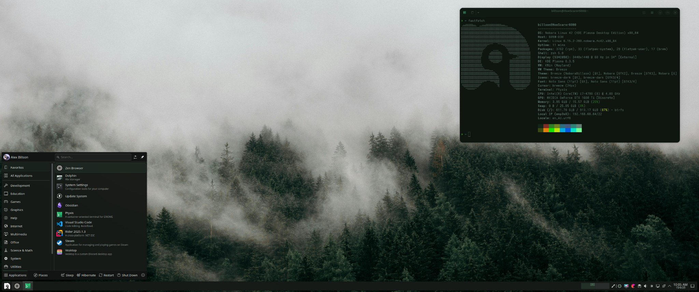
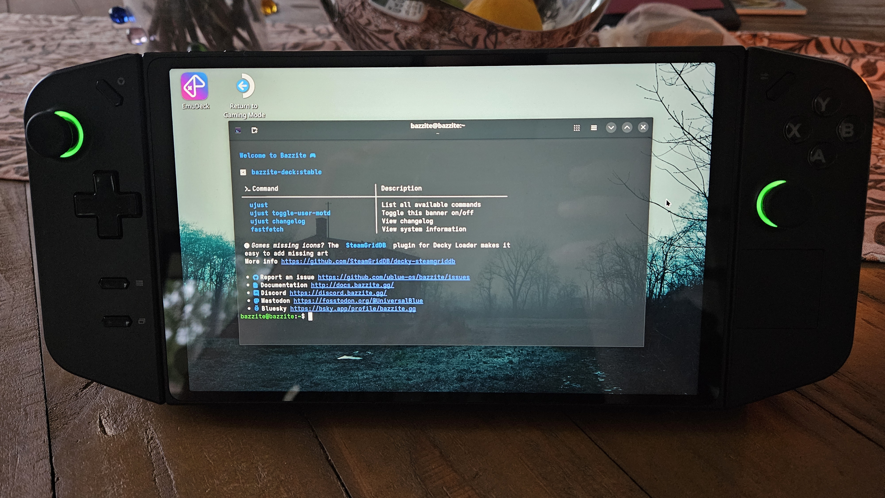

## Preface

I've spent a bit of time using Linux as someone who considers themselves a regular grass toucher so use this as a guide to actually enjoying your computer again and dropping Windows.

## What actually is Linux?

Something that is both a blessing and a curse with Linux is the nature of how it is developed is that the fact you're using Linux is 
generally quite abstracted away from what you day to day.

Linux is a base (technically the _kernel_) of all these varieties (formally known as Distributions or Distros) of operating systems. 
Often times you probably don't even know what version of the kernel you are running, that's fine, you probably don't know what specific 
version of Windows you're running either.

When someone _"moves to Linux"_ they're moving to a Linux distribution - each distribution has a few layers before you get to the thing you're actually using. 

For example, when you are using Ubuntu (a popular but kinda shithouse distro) you are using _a desktop environment based on GNOME_ which sits on top of _utilities and programs which are bundled in with Ubuntu_ which is heavily based on _the Debian distro_ which is based on _the Linux kernel_. Once again, you don't need to really care about this BUT all of this is to say a lot of the time with Linux you're really just picking:

1. A desktop environment
2. An operating system which is OR is based off a prominent distribution of Linux

## What changes when moving on from Windows?

Your desktop being a separate component from your core operating system is not where the differences end. In defence of these changes; they're not too hard to get used to for casual use and are a net positive once you're willing to embrace them.

### Installing Applications

Whilst Windows _does_ have an [app store](https://au.pcmag.com/migrated-15175-windows-10/113112/microsofts-app-store-has-been-broken-since-windows-8-can-it-finally-be-fixed) and _has_ 
embraced package managers such as [Winget](https://learn.microsoft.com/en-us/windows/package-manager/winget/) for installing 
software packagers from a central spot - these are still the exception to the standard way people use Windows. The same can be 
said for macOS; whilst the mac app store is more popular than the Windows equivalent it is unfair to say its the predominant 
way people install apps.

You typically will find an installer online for your applications, which will then include the application along with some form of self-updater for many modern programs.

Linux distributions will consistently encourage the usage of _package managers_ for installing software (packages). To a casual 
user these are essentially app stores; many modern Linux distributions will go out of their way to draw this comparison.

My distro of choice provides an app store (Bazaar) which really tries to hammer this home:

The two key types of packages are:

1. Traditional Native Packages - these are core applications and will often require you to install the package as an admin, historically these are installed by the distributions using a command line utility although many modern installations have these installable using the same app stores as the other type of package. Think system utilities, and programs that require a greater level control over your computer.
2. "App" Packages - these are applications that don't actually modify your install, installable without any administration privileges and are typically more aligned with what you like to install on your computer. Think web browsers, music players, office apps, chat apps.

"Apps" on Linux are a relatively new thing and have helped with adoption massively - the most predominant of these app 
technologies being "Flatpak". Using a website like [Flathub](https://flathub.org/en) to see what apps are available on Linux is 
a great way to confirm if you're ready to make the switch - you'll find popular apps like [Steam](https://flathub.org/en/apps/com.valvesoftware.Steam), [Spotify](https://flathub.org/en/apps/com.spotify.Client), and [Discord](https://flathub.org/en/apps/com.discordapp.Discord).

A nicety of all of this tech - it is incredibly easy to update packages on Linux no matter the type and _you_ are in control of 
when this happens. Your operating system is just a collection of packages, when you want to update your OS you can using the 
same methods as updating your browser.

All of this to say - yes installing apps on Linux is different but once you get over the difference it is a lot simpler.

### The Command Line

Scary stuff I know, but _yes_ there is a higher need to use the command line on Linux **but** I don't think it is a 
_requirement_.

As more and more distributions are created and existing distributions receive tooling to assist with usage, more user 
interfaces are being added to abstract away the command line. 

It's hard for me to comment on this objectively as I am a ~loser~ developer who like many developers LOVES this shit.

If I had to think of scenarios where the terminal is **absolutely** needed; 

1. Troubleshooting very specific issues with software or hardware
2. Configuring anything you'd not care about if you were scared about using the terminal

In many cases scenario 1 will be a process of taking a command from the internet, pasting it into the terminal, and clicking enter. With modern hardware however its very hard to find instances where this would be typically needed and as we'll talk about in the distro breakdown - many modern distros will handle this all for you.

My final stance on all of this is you should consider learning the basics of the Linux shell but more because it is a nice to 
have as a user of a computer. Linux and macOS are both based off Unix at its core which means that the way you use the terminal 
is applicable to both.

### Compatibility with Windows

This is the elephant in the room when trying out Linux and I had to pick if Windows productivity software or Windows games 
worked better on Linux - the answer is surprisingly the latter. Gaming on Linux continually gets better - unless a game is 
using kernel-level anti-cheat (something that Linux as an operating system will never support) the reality is thanks to Valve's 
Proton compatability software many new releases will work fine and in many cases old release will run better on Linux with less 
headaches compared to modern Windows. The same software that makes the Steam Deck a viable gaming platform make all Linux 
distributions viable for gaming. 

The rule of thumb is that if a game is Steam Deck Compatible it will run on your installation of Linux - as of this year there 
is even [a filter for general Linux support to reduce confusion](https://store.steampowered.com/linux).
There is also [ProtonDB](https://www.protondb.com/) which has troubleshooting steps in the event a certain game doesn't work perfect out of the box.

With regards to regular Windows software, Wine has been the standard compatibility tool to use (Proton is based on Wine) 
however I have to shoutout [Bottles](https://usebottles.com/). Its simple and comes with a lot pre-configured to make this 
seamless. 

The reality unfortunately for productivity software there is an incentive for companies to not support Linux and drive users to 
Windows. If you can't make things work nicely in Linux for required Windows software dual-booting might need to be the way but 
I've found these methods are more than enough.

## What should deter you from using Linux?

The reality is there are things that stop you from using Linux, these are:

1. You play games with anti-cheat (popular multiplayer games)
2. You play games on a platform besides Steam (this is getting better but Game Pass for example)
3. You use Adobe products
4. You can't bring yourself to use Microsoft Office in the browser or an alternative to Microsoft Office like [LibreOffice](https://www.libreoffice.org/)

If none of these deter you, you're sorted and can give it a crack.

## What do you recommend for Distros?

This is the tough part as there's no one specific version of Linux but I've used a few and I can give some recommendations.

### Ubuntu

Ubuntu is _fine_, it is easily the most popular distro **but** it is incredibly boring and is becoming more and more like Windows. I would 
avoid it purely as it just a bit lame and it does take the fun out of things a bit but if you just want something you know will work this 
is one of the distros that falls into that category.

### Linux Mint

[Linux Mint](https://www.linuxmint.com/) was the first one I picked, it is really good! I would pick this over Ubuntu for an _"it just works"_ distro as they genuinely are doing some amazing stuff for making Linux user friendly.

The only reason I moved on from Linux Mint is it is a generalist distro - I'm decent with computers so I actually just wanted something a tiny bit rougher around the edges. Generally with distros like Linux Mint they forego tuning the performance perfectly and using the latest and greatest to just make something stable. You might have a few less frames over another distro with Mint but it does just work.

Another reason I moved on from Linux Mint is the desktop is just _fine_, like its boring but we like boring.

It's entirely dependent on what you care about, people always talk about how they chuck Linux Mint on their Nanna's computer so take that as a good example of the crowd it caters to.

### Nobara

[Nobara](https://nobaraproject.org/) is what I currently use on my desktop.

Nobara is based off the Fedora Desktop OS but it does some fun stuff to make it more interesting and better for Gaming.

For starters it uses the KDE Desktop environment, KDE is the nicest looking desktop on Linux and honestly I can't see myself using anything else.
It's just modern Windows 7, it just works, it has a tonne of great features, looks amazing on a 4K monitor, you can customise it so much or just leave it.
10/10, no notes.

Nobara is a gaming oriented distro so apps like Steam comes out of the box, it also has many variants where for example you can have it boot into Steam Big Picture.

I do like Nobara HOWEVER I have some minor complaints which aren't crazy bad but I've gotta be transparent that it does do things that would annoy me as a regular user.
Linux updates are pretty much always optional so this criticism can be dismissed with "just don't update it" but Nobara gets so many updates at times it can be annoying.
On a near weekly basis there'll be updates for like 50 packages, these often don't require restarts unlike Windows because every Linux distro has actually figured out software updates.

Nobara also has a really small team around it and I would push it more as enthusiast distro for that reason as some processes
can be very DIY - I like the terminal and even though Nobara does have a UI for everything it does lean in to using the terminal for certain configs.

It's probably my Number 2 pick.

### Bazzite / Aurora

[Bazzite](https://bazzite.gg/) has had a huge year - I would say it is the best plug-and-play Linux distro for gaming.

Without getting into specifics, what makes Bazzite different to all the other distros mentioned is that it is an "Immutable 
Distro". Immutable distros are slightly different to regular distros as they essentially at anytime will nuke your install 
**and this is a feature**. Jokes aside when you update an immutable distro it will replace the entirety of your operating 
system with a fresh copy _excluding_ your home directory. I'm not going to go into specifics but for Bazzite this means that the only things that you keep between updates are:

1. Your files
2. Your installed apps and files for those installed apps

You're probably wondering _"what else would I want to keep?"_ - great question, for many people this is actually all you need. 
If you are not making changes to the native packages and system level configurations of your device, immutable distros are 
great. If you are an entry level user who is scared of the terminal these distributions actually reward you for that mentality.

Why does Bazzite work like this? The benefits of this approach are:

1. Your computer will automatically update as part of it turning on, new updates are downloaded in the background, if something breaks you can rollback to the last version exactly as it was
2. It's very unlikely things will break because your OS is essentially frozen to a specific version
3. If you do manage to break something the computer will fix itself as part of this update method

Bazzite has usen this "image based" approach to also make variants of the OS that support specific devices, using Bazzite can allow you to create a homemade Steam Deck like I did with a Legion Go:

Bazzite can be configured to create a living room gaming rig, a gaming oriented desktop, a gaming laptop that works as well as a Steam Deck - all without any considerable tinkering.

I mention both Bazzite and [Aurora](https://getaurora.dev/en) as Aurora is from the same company as Bazzite and has many of the 
same features **but** is oriented more to a non-gaming user. Personally I have Aurora installed on my laptop and Bazzite on 
Legion Go, many of the same features across both.

This is my personal pick for anyone getting into Linux, it's dead simple and I've never had an issue with these distributions.
