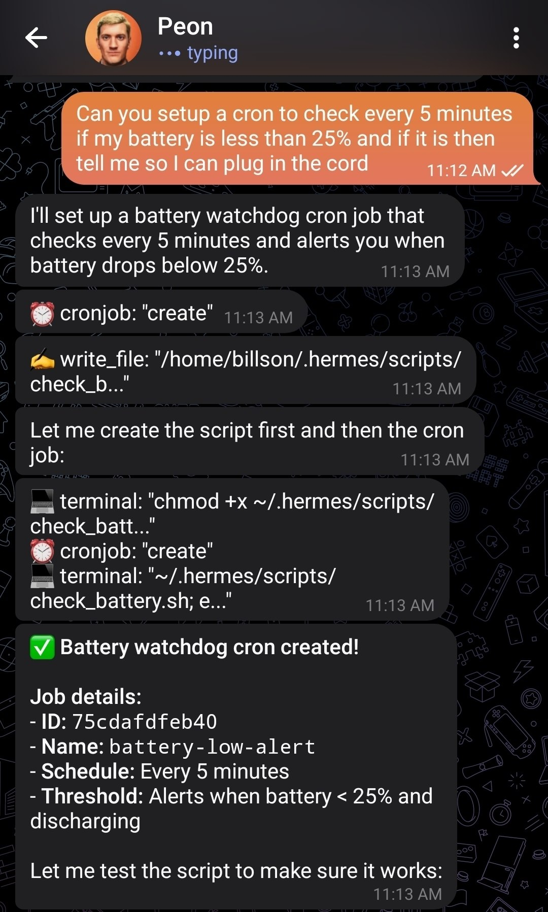

I tried [Hermes](https://hermes-agent.nousresearch.com/) over the weekend and actually had a good time with it. I'm typically not someone who uses AI in my personal life, so when OpenClaw was doing rounds earlier this year it didn't appeal to me much. I've only been vindicated for making the effort to avoid that mess. Peter Steinberger is a talented dude, but just says some shit which makes it very hard for me to like him. Loves to chat about how he doesn't read the code he writes and subsequently [has a project with literally hundreds of CVEs.](https://days-since-openclaw-cve.com/) All this tangent to say, I can acknowledge OpenClaw has made big moves in helping us figure out what to do with these big capital expenditure guzzlers, but it would've been even cooler if it was written with just a little bit more care.

Hermes is one of the many alternatives that tries to do this. [Nous Research](https://nousresearch.com/releases) make some very cool stuff, and whilst they've struck gold with Hermes, I really am pulled to their drive to improve open models out of the US. There seems to be better security involved in its design; even basic curl requests with heavy query string usage often required confirmation from me due to common exploits.

My Hermes Agent "Peon" lives on the same laptop which was featured in my [immutable distros](/ramblings/2025-03-14_immutable-distros/) article. Any skills I have with computers are bound entirely to software, as I completely cooked a keyboard replacement that broke the trackpad in the process. Thankfully there's 16 precious gigabytes of RAM in this thing and an i7, so it's good enough to be my home server with the lid perpetually closed.

## The adventures of Peon

Hermes' killer feature is the "self-improving" nature of the software. Every message has the potential to write to one of the many Markdown files that backs the agent's memory. 

Something as simple as checking the prices of specific Magic Cards on my local game store's website eventually could be asked using shorthand. You almost need to rewire your brain a little bit to think how best to prompt the agent to better persist things.

This post, for example, will get posted by Peon as I've cloned billson.me's repo to the host, and editing Markdown files is very trivial.

I feel this kind of workflow is a slippery slope into some [pretty unhealthy habits](https://www.linkedin.com/posts/tomdkerwin_apparently-in-silicon-valley-right-now-activity-7439747785790410752-gaWx?utm_source=share&utm_medium=member_android&rcm=ACoAACICMlYBwbktMtf2LRJ62Y9C0vrE9tfRpfY), but on the more optimistic side of things, it's a really neat way to interact with a Linux server. My original goal for setting this all up was to get Affine running as a self-hosted Notion alternative; Peon helped get everything set up in `podman`, even inclusive of troubleshooting Postgres container startup issues. 

You're rewarded for preferring containerised and rootless software; this is consistent with the direction Fedora seems to be heading with its ["Hummingbird model"](https://fedoramagazine.org/fedora-hummingbird-linux-taking-the-hummingbird-model-to-the-full-os/).

With regards to model choice, I've been loving Opencode Zen/Go as a model provider for open weight options, and Hermes supports it out of the box. I'm a big fan of Kimi K2.5 as a model that's smart enough to be useful without spending a painful amount of time thinking (looking at you, K2.6). All up, my usage for Peon sits at $1.75 USD, which I do feel, for all fun and games, has been incredibly good value.

So overall I'm happy with the time I've spent using Hermes. Not sure if the honeymoon period will wear off, but it is cool to see how this ecosystem is developing and how open weight models really lower the barrier to entry.
