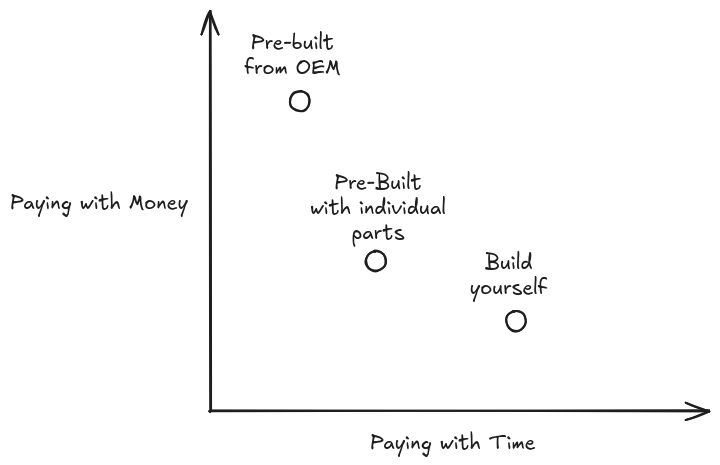
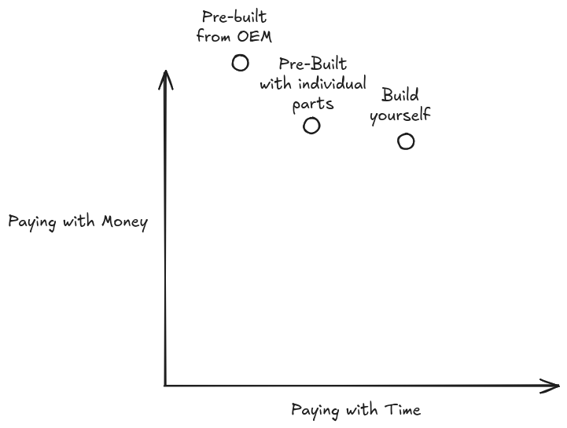

As the title says, [the Steam Deck costs too much now.](https://press-start.com.au/news/2026/05/28/steam-deck-oled-price-increase-australia-2026/) 

From a typical consumer perspective this is not something that rings many alarm bells. Noting this to my girlfriend (who definitely gives as much of a shit about the matter), her original reaction assumed this was just what happens as inflationary/shrinkflationary pressures continue to impact consumer goods.

"Market conditions" aside (Valve is yet to provide a reason for the price increase); you can point the finger squarely at AI for this bump.
I understand that we need to be careful when assuming the best of large companies like Valve, but the ethos of the Steam Deck as a product massively contradicts these changes. 

The design of the deck in so many ways bucks the trend of PC gaming striving for higher performance, smoother frames, larger games. [If you look at the specs](https://www.steamdeck.com/en/tech), it's incredibly reserved. It does not reach 1080P in resolution, it uses a 6 year old processor architecture in Zen 2 (we're approaching Zen 6), 16GB of RAM does the job but there's an argument that's the bare minimum these days. If Valve tried anything more exciting we would've seen these price increases much sooner; the beauty of this design is its laser focus on delivering a specific experience which supports these concessions.

You don't need 720P on a screen this small, the 16GB of RAM does the job, you're playing Balatro on this thing anyway. Just over a year ago I decided I wanted to spend money for no reason and ended up buying a Legion Go refurbished. My justification was _"it'll be good for our flight to Europe next year"_, what sounded like a very weak excuse at the time to drop a band on a gaming handheld was, in retrospect, an investment.

I love my handheld, it's reinvigorated my love for gaming more than any console or PC could have. That being said I can see why Valve made the decisions they did with the Steam Deck as I use my Legion Go and can admit that the better device is the deck. 

This aside is to emphasise that what Valve is doing with the Steam Deck and SteamOS has been a masterful creation of a very particular kind of ecosystem.
Gaming on Linux has benefited massively from the compatibility work Valve has done for the Steam Deck and we can see this momentum continuing with their efforts to support gaming on ARM devices (projects like [GameNative](https://github.com/utkarshdalal/GameNative) are a glimpse of what PC gaming on an ARM device allows for). 
Valve want you using Steam, and are doing everything they can to provide you the avenues to access the store front. They have done this through
being a tide that lifts all boats with regards to open source gaming.
[Historically the 30% cut taken by Valve for Steam sales has been criticised](https://www.polygon.com/2019/1/24/18196154/steam-developers-revenue-epic-games-store/), but my tune on this has changed as this revenue share is clearly being invested back into a gaming ecosystem which encourages choice and openness.

I should assume malice of any price increase, but a decision like this is so perpendicular to the direction Valve have been heading in that I do 
believe it is driven by external factors. Even if you game on Windows, or you don't game at all, or you think Valve is a garbage company — this price increase signals, loudly and clearly, what is to come.
The components of the Steam Deck are over half a decade old, its original sales pitch was an entry-level device and that has only become more true with time. 
In any prior console generation the idea that the hardware would RISE in prices this late into its effective lifespan is unheard of; it has completely ruined 
any reasoning to buy these devices. 

The big three have had to make similar cost increases:
* Since 2025 the Xbox Series X console is also *30%* more expensive than it was at launch (a massive increase for a console people already didn't rate in the first place)
* Same for Sony: despite maintaining a facade of having everything under control compared to Microsoft, they did crack in 2026 and the PS5 Disc Model is also *30%* more expensive than it was at launch
* Nintendo went as far to increase the price of the original Switch _multiple times_ (a piece of hardware which is based on silicon from 2014, with specs equivalent to a phone from the same era) to offset the cost of producing the Switch 2 — this didn't work, the Switch 2 will have its price raised by $50 USD as of September

It is admirable that many manufacturers have been able to cop the cost of production on the chin as long as they have but the reality is you are just delaying the inevitable. Gaming consoles are not immune to the impact of the memory crisis; your Mario Machine going up in cost is an indicator of a pattern you need to get used to across all forms of personal computing.

---

I don't necessarily subscribe to the [line of thinking that all of this is to eliminate your ability to own your hardware](https://www.windowscentral.com/hardware/ai-hardware-shortage-end-local-pcs-conspiracy-theory#:~:text=Conspiracy%20theory%20or,for%20subscription-based%20cloud&text=A%20deep%20dive,and%20what%E2%80%99s%20exaggerated.&text=A%20banner%20that,personal%20PCs%3F%20Yes.), but I do recognise that the reason things have gotten this bad is because the tech industry 
has quite literally nothing to lose from letting this happen. Modern tech is overwhelmingly B2B, B2C endeavours are second class initiatives in comparison. 
I think [Nvidia's decision to omit gaming entirely from their quarterly updates](https://www.pcgamer.com/software/ai/nvidia-reminds-us-its-not-a-gaming-company-anymore-but-an-ai-data-center-infrastructure-company/) is the best example of saying this quiet part out loud. 

The news about the Deck price increase left me deflated because it shows that even a reserved and considerate device will still experience market pressures which completely destroy its ability to exist in the modern computing landscape. The general price increase of PC components sucks but there is a line of sight between the 5090 you want to put in your next build and the VRAM which could sit in the datacentre going up next to your house. When the device by design is a little bit shit and **STILL** is unable to exist at a reasonable price point it hits a little different. 

The general rule of thumb for consumption is an option that is more accessible will always have a markup compared to alternative pathways which require more 
know-how. Buying a pre-built gaming PC from JB HiFi is the easiest way to get started but you are paying a markup over buying a pre-built from a distributor such as 
PC Case Gear which is also a markup over just building the thing yourself. You apply this same modelling when renovating a bathroom; it's applicable to pretty much 
everything that has the option of doing it yourself or paying a professional.

Historically, that curve looked something like this:

The demand for these core components that make up the PC has completely thrown off this curve:

I need to stress that _I know this primarily has focused on gaming PCs_. This is going to suck for everyone at some point. 
I hope I am wrong, but as we obliterate the affordability of gaming devices the next logical victim is the general purpose computer. 

There is hope that manufacturers can creatively buck the trend with devices such as the MacBook Neo. It is an engineering marvel, [competitors have been so incredibly caught off guard by what Apple managed to pull off](https://www.windowscentral.com/microsoft/ex-windows-chief-calls-macbook-neo-a-paradigm-shifting-computer-reflects-on-surface-failure-and-windows-on-arm-while-lamenting-we-were-early-but-not-wrong).
You cannot forget however that this is a phone dressed up in a laptop chassis. Whilst that is an incredibly smart way to reuse existing internals, the [Mac mini no longer has a 256GB entry tier and copped a price hike.](https://www.macworld.com/article/3129806/mac-mini-starting-price-rises-to-799-as-apple-stops-offering-256gb-option.html)

---

In the past 6 months my views on AI have shifted to be some sort of flavour of AI Acceptance rather than flat out AI Refusal. [I have written on this very blog about how excited I am by what is happening in the open weight models space](https://billson.me/ramblings/2026-05-21_my-opencode-go-picks) 
and I know some people around me do probably wonder how much I have leaned into the AI booster camp.

I think despite integrating it more into my life, my fundamental view on the technology has not changed at all. Whilst the technology continues to have its uses, the 
economics and broader negative impact it has had on so many other facets of life do not justify its development. 

Claude Opus 4.5 was an inflection point for many as a time where we saw these plagiarism machines actually could produce pretty solid code. For side projects I have 
found the Kimis, Qwens and Deepseeks of the world provide a cost effective way to deliver more than I have ever been able to with the free time I have. I even 
believe with the right dilligence and approach to using these tools that you can incorporate them without cognitive decline (please hold me to this if I can barely write an for loop without AI assistance in 2030).

That said, everything just sucks because of it and I can't say the juice is worth the squeeze.

I may be more productive than I ever have been, but it is harder than ever to have enjoy computing. I learnt to code because I wanted to make video games, having 
devices which supported my hobbies helped scratch both the itch to create and play. My concern with the barriers to entry for personal computing rising with no 
clear reprieve in sight, there will be less people who can turn something they find fun into a career (maybe that's a good thing, I loved programming as a teenager, so much so that I became a software developer instead of pursuing law, lmao nice one Alex).

As much as people in the industry love to act like AI ["democratises"](https://www.reddit.com/r/vibecoding/comments/1sh5ynp/why_do_vibecoders_think_ai_has_democratised/) computing tasks like programming, (it doesn't, text editors and compilers have been mostly free, documentation has pretty much always been free, YouTube has always been a fantastic tutor, learning a skill requires effort and I'm sorry if you have this confused with a lack of 'democratisation') the rising costs of the entry into this space show that it is is quite the opposite.

The need for this industry to hyperscale at the expense of so much around it is why the general sentiment around AI from a consumer perspective is so negative.
Members of the general public may not in many cases care about the rising costs of AI, but they may be annoyed how all their favourite social media websites are 
overrun with generated slop content, or how their future job prospects are in limbo, or how there's a server farm going up down the road from them with zero 
consideration for them in the process.

The growth of AI has been parasitic, unethical, and unsustainable. So much of the current economy is positioned to support sending prompts to an LLM and nothing 
else. My hope is that we do hit a point where things self-correct to an extent, until then I'll continue to be nostalgic for a more fun era of computing.
